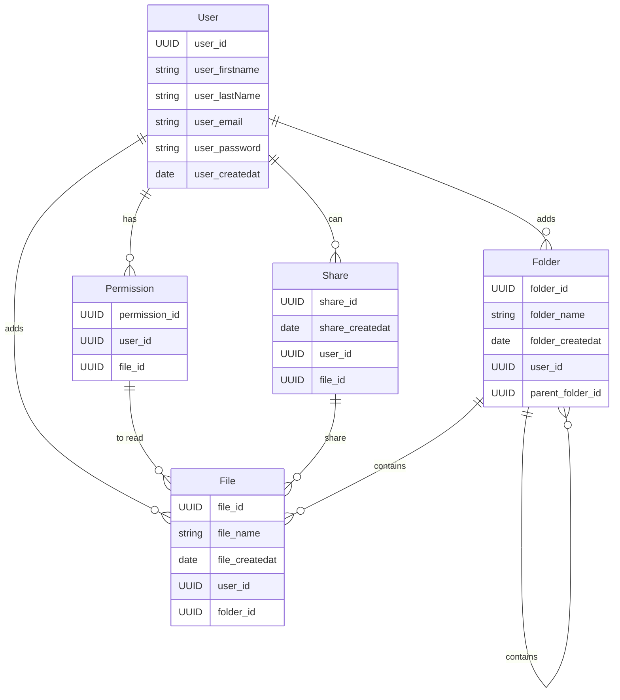

# funky-drive

https://hackmd.io/xkFbF2WjSR2073tECWnG-A

## Stack

- React JS
- Java avec le framework Spring boot
- SQL Postgre

## Entités

User

User_Id: UUID
User_FirstName: string
User_LastName: string
User_Email: string
User_Password: string
User_CreatedAt: date / Timestamp

File

File_Id: UUID
File_Name: string
File_CreatedAt: date / Timestamp
User_Id: UUID
Folder_Id: UUID

Folder

Folder_Id: UUID
Folder_Name: string
Folder_CreatedAt: date / Timestamp
User_Id: UUID

Share

Share_Id: UUID
Share_CreatedAt: date / Timestamp
User_Id: UUID
File_Id: UUID

Permission

Permission_Id: UUID
User_Id: UUID
File_Id: UUID

## Entities representation

## architecture projet sur Spring boot

|-- main
    |-- java
        |-- com
            |-- example
                |-- config
                    |-- JwtConfig.java
                    |-- SecurityConfig.java
                |-- controller
                    |-- AuthController.java
                    |-- FolderController.java
                    |-- FileController.java
                |-- model
                    |-- User.java
                    |-- Folder.java
                    |-- File.java
                |-- payload
                    |-- request
                        |-- LoginRequest.java
                        |-- SignupRequest.java
                    |-- response
                        |-- JwtResponse.java
                        |-- MessageResponse.java
                |-- repository
                    |-- UserRepository.java
                    |-- FolderRepository.java
                    |-- FileRepository.java
                |-- service
                    |-- UserService.java
                    |-- FolderService.java
                    |-- FileService.java
                    |-- impl
                        |-- UserServiceImpl.java
                        |-- FolderServiceImpl.java
                        |-- FileServiceImpl.java
                |-- JwtTokenProvider.java (Custom JWT Provider class)
    |-- resources
        |-- application.properties